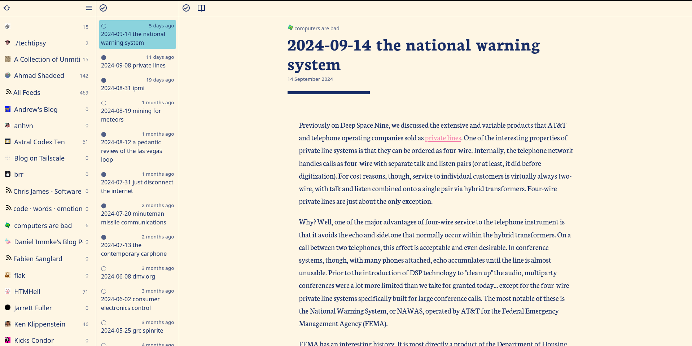

# Dispatch

Dispatch is a RSS feed reader written in python with sqlite -> flask -> htmx/alpinejs. Initially I started out to clone [yarr](https://github.com/nkanaev/yarr), with a good chunk of equivalent features having now been implemented.



## Run locally

### Prerequisites

- [Just](https://github.com/casey/just) installed
- [Python 3](https://www.python.org/downloads/) installed
- [Docker](https://docs.docker.com/engine/install/) installed (if you want to build the container yourself)

1. Run `just init` to create a python virtual environment and install the requirements and initialise the database.
2. Run `just run` to launch the app.

## Run with docker

Use one of the below examples to run the docker container. Feed Icons will be stored outside the database under `/static/img` until i get around to sorting those out.

### Docker Run

```bash
docker run -d \
  --name dispatch \
  -p 5000:5000/tcp \
  --restart unless-stopped \
  -v /config/path/dispatch/data:/data \
  -v /config/path/dispatch/assets:/static/img \
  ghcr.io/josh-tucker/dispatch:release
```

### Docker Compose

```yaml
version: '3.7'
services:
  caddy:
    image: ghcr.io/josh-tucker/dispatch:release
    container_name: dispatch
    ports:
      - 5000:5000/tcp
    restart: unless-stopped
    volumes:
      - /config/path/dispatch/data:/data
      - /config/path/dispatch/assets:/static/img
```
