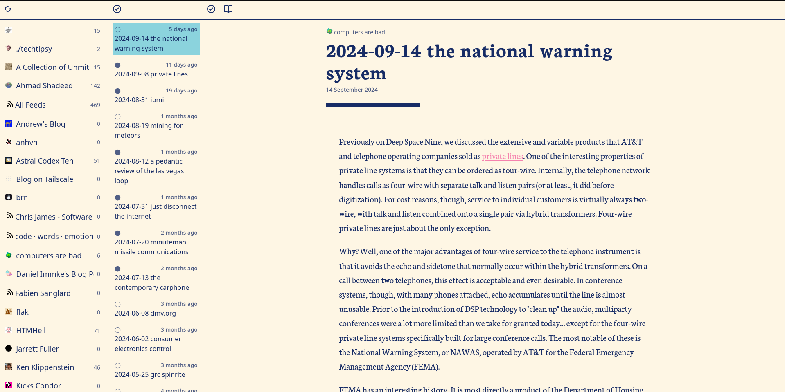

# Dispatch

Dispatch is a RSS feed reader written in python with sqlite -> flask -> htmx/alpinejs. Initially I started out to clone [yarr](https://github.com/nkanaev/yarr), with a good chunk of equivalent features having now been implemented.



## Recent Updates

**Automatic Feed Updates**: RSS feeds now update automatically in the background:
- All feeds are refreshed every 24 hours automatically
- Individual feeds are staggered throughout the day to distribute load
- Background scheduler runs independently of user interactions
- Manual refresh still available for immediate updates
- Scheduler status and controls available in Settings page

**Project Restructuring**: The codebase has been reorganized for better maintainability:
- Database models moved to `dispatch/models/` directory
- Automatic migration system added in `dispatch/migrations/`
- All database migrations now run automatically on startup
- See `dispatch/STRUCTURE.md` for detailed information about the new organization

## Run locally

### Prerequisites

- [Just](https://github.com/casey/just) installed
- [Python 3](https://www.python.org/downloads/) installed
- [Docker](https://docs.docker.com/engine/install/) installed (if you want to build the container yourself)

1. Run `just init` to create a python virtual environment and install the requirements and initialise the database.
2. Run `just run` to launch the app.

## Run with docker

Use one of the below examples to run the docker container. Feed Icons will be stored outside the database under `/static/img` until i get around to sorting those out.

### Docker Run

```bash
docker run -d \
  --name dispatch \
  -p 5000:5000/tcp \
  --restart unless-stopped \
  -v /config/path/dispatch/data:/data \
  -v /config/path/dispatch/assets:/static/img \
  ghcr.io/josh-tucker/dispatch:release
```

### Docker Compose

```yaml
version: '3.7'
services:
  caddy:
    image: ghcr.io/josh-tucker/dispatch:release
    container_name: dispatch
    ports:
      - 5000:5000/tcp
    restart: unless-stopped
    volumes:
      - /config/path/dispatch/data:/data
      - /config/path/dispatch/assets:/static/img
```

## Features

### Automatic Feed Updates
- **Background Scheduler**: Feeds are automatically updated every 24 hours
- **Staggered Updates**: Individual feeds are refreshed at different times throughout the day to distribute system load
- **Error Handling**: Failed updates are logged and don't stop other feeds from updating
- **Manual Override**: Users can still manually refresh feeds at any time
- **Scheduler Control**: View scheduler status and reschedule jobs from the Settings page

### API Endpoints
- `GET /scheduler/status` - Check scheduler status and view scheduled jobs
- `POST /scheduler/reschedule` - Reschedule all feed refresh jobs (useful after adding/removing feeds)

### RSS Feed Management
- Add feeds via URL or OPML import
- Automatic favicon detection and caching
- Feed tagging and organization
- Pin important feeds
- Mark entries as read/unread
